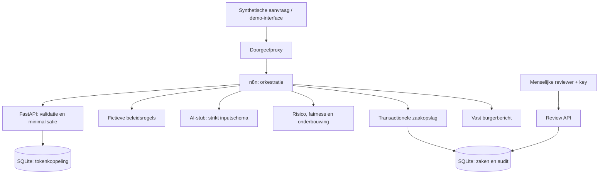

# Architectuur en gegevensgrens

De pijlen tussen n8n en services staan voor afzonderlijke HTTP-aanroepen. De volledige workflow zit niet in de backend. De reviewer werkt na de eerste ontvangstbevestiging; ook laagrisicozaken wachten op een menselijke beslissing.

| Grens | Toegestane gegevens |
|---|---|
| Invoer → validatie | Alleen synthetische identificatie, toestemming en aanvraagkenmerken. |
| n8n → AI | `ageGroup`, `requestType`, `severity`, `problemCount`, `limitations`, `existingSupport` en fictief beleid. |
| Systeem → burger | Dossiernummer, status, vast transparant bericht en waar opgenomen de geminimaliseerde demoinput. Geen verdachte AI-onderbouwing. |
| Systeem → reviewer | Voorstel, onderbouwing, risico, flags en status; reviewerkey vereist. |
| Systeem → audit | Token/caseId, gebeurtenissen, voorstel, reden, score, flags en versies. |

De AI-service weigert extra velden. De stub heeft geen externe tools en geen bevoegdheid om beslissingen op te slaan. Opslag gebeurt door de reguliere backend onder n8n-orkestratie. De SQLite-opslag gebruikt een Docker-volume.

Keuzes: FastAPI sluit aan op Pythonkennis; één service beperkt integratiewerk; SQLite maakt de lokale demo zonder databaseserver reproduceerbaar; de stub maakt de vier tests deterministisch; HTML zonder framework bespaart buildcomplexiteit. De grenzen van deze keuzes staan in de README.
