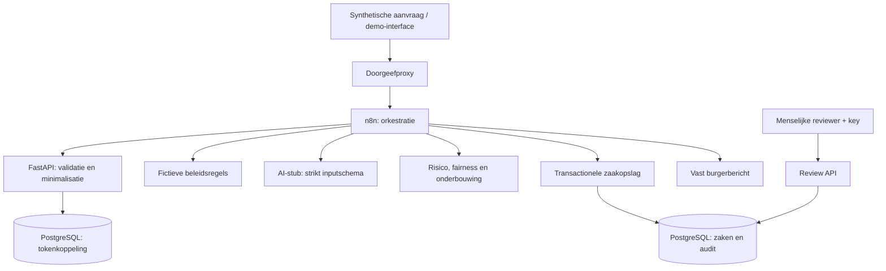

# Architectuur en gegevensgrens

De pijlen tussen n8n en services staan voor afzonderlijke HTTP-aanroepen. De volledige workflow zit niet in de backend. De reviewer werkt na de eerste ontvangstbevestiging; ook laagrisicozaken wachten op een menselijke beslissing.

| Grens | Toegestane gegevens |
|---|---|
| Invoer → validatie | Alleen synthetische identificatie, toestemming en aanvraagkenmerken. |
| n8n → AI | `ageGroup`, `requestType`, `severity`, `problemCount`, `limitations`, `existingSupport` en fictief beleid. |
| Systeem → burger | Dossiernummer, status, vast transparant bericht en waar opgenomen de geminimaliseerde demoinput. Geen verdachte AI-onderbouwing. |
| Systeem → reviewer | Voorstel, onderbouwing, risico, flags en status; reviewerkey vereist. |
| Systeem → audit | Token/caseId, gebeurtenissen, voorstel, reden, score, flags en versies. |

De AI-service weigert extra velden. De stub heeft geen externe tools en geen bevoegdheid om beslissingen op te slaan. Opslag gebeurt door de reguliere backend onder n8n-orkestratie. De runtime gebruikt drie containers: PostgreSQL voor app- en n8n-data, FastAPI voor de applicatie en n8n voor orkestratie. Alle persistente data staat lokaal onder `./data`.

Keuzes: FastAPI sluit aan op Pythonkennis; één applicatieservice beperkt integratiewerk; PostgreSQL sluit aan op de VM-deployment; de stub maakt de vier tests deterministisch; HTML zonder framework bespaart buildcomplexiteit. De grenzen van deze keuzes staan in de README.
